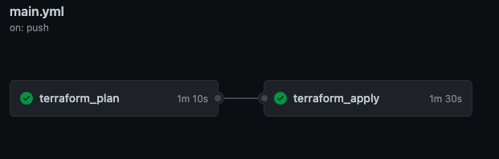
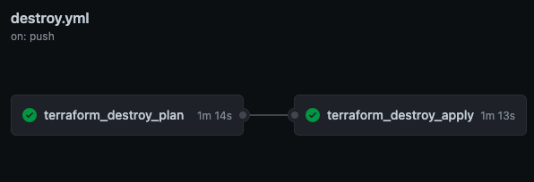
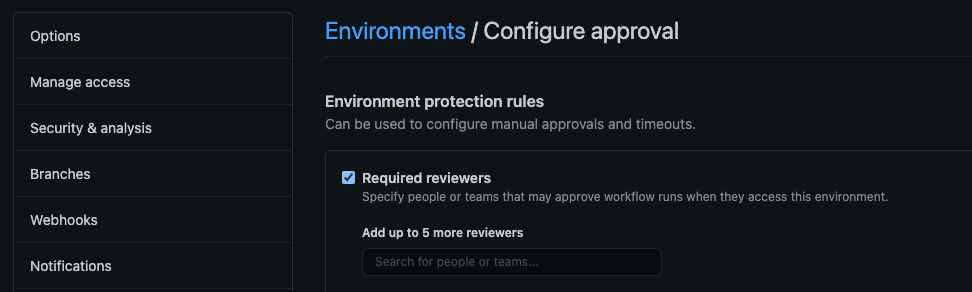

# Pathways Dojo Infra Node Weather App

This repository is used in conjunction with the Contino Infra Engineer to Cloud Engineer Pathway course delivered in Contini-U.

It includes and supports the following functionality:
* Dockerfile and docker-compose configuration for 3M based deployments
* Makefile providing basic Terraform deployment functionality
* GitHub workflows for supporting basic Terraform deploy and destroy functionality
* Terraform IaC for the test deployment of an s3 bucket
* Node Weather App - https://github.com/phattp/nodejs-weather-app

## Features

- Separate network and application layers
- Auto Scaling on AWS Fargate for weather app
- Automated build and push to ecs on commit with manual approval for deployment of the weather app to ecs
- Automated Terraform Plan with manual approval for apply on commit
- Easy destroy pattern by pulling to the `destroy` branch
- SSL Security with automated DNS challenge validation on the configured domain

## Github Workflows

- ENVFILE variable scoping.

The `docker-compose.yml` file uses variable substitution such that if `ENVFILE` is present in the shell, it will override the default.
This is used because locally the `.env` file will be used in the `./infra` folder, however for github actions this file doesn't exist since it's never committed to the repo. Instead we override the `ENVFILE` variable to point it to the `env.template` file instead so the docker build doesn't fail.

## Using MAKE

The commands for make allow specifying the environment (infra layer) to apply terraform commands to the specified layer.

```sh
$ make [command]
```
### Commands:
- `init ENV=<layer>` - runs `terraform init`, `validate` and `format` on the target layer
- `plan ENV=<layer>` - runs `terraform plan` on the target layer
- `apply ENV=<layer>` - runs `terraform apply` on the target layer
- `destroy_plan ENV=<layer>` - runs `terraform plan -destroy` on the target layer
- `destroy_apply ENV=<layer>` - runs `terraform destroy -auto-approve` on the target layer
- `run_[command] ENV=<layer>` - runs `make init` followed by the specified command
- `console ENV=<layer>`
- `list_bucket` - used to test s3 credentials, runs `aws s3 ls` to list buckets
- `build` - used to build the docker image for the web app
- `login_ecr` - logs in to ecr using docker
- `push` - used to push the docker image of the web app to the currently logged in repository


### Layers:
- `reg` - aws ecr for pushing image builds to
- `vpc` - the network layer
- `app` - ecs for container orchestration, balancing and scaling

### Example:
```sh
$ make run_plan ENV=vpc
```

<br> 

## Getting Started
This GitHub template should be used to create your own repository. Repository will need to be public if you are creating it in your personal GitHub account in order to support approval gates in GitHub actions. Configure the following to get started:
* Clone your repository locally. It should have a branch named `master`.
* Create a `destroy` branch in your GitHub repo. This will be used to trigger Terraform Destroy workflow during pull request from `master->destroy`.
* Create an environment in your repository named `approval` to support GitHub Workflows, selecting `required reviewers` and adding yourself as an approver.
* Create GitHub Secrets in your repository.
* Push local changes to the GitHub repos master branch, which should trigger the Github deploy workflow, and deploy the changed environmeny layer. Remember to review tf plan and approve apply.
* Create a pull request to merge `master` changes to `destroy` branch. Merge changes to trigger the Github destroy workflow which will initially plan destroy of the changes environment layer. Remember to review the tf speculative plan and approve destroy.


<br> 


### network/registry/application.yml workflow


<br>

### destroy_network/destroy_registry/destroy_application.yml workflow


<br>

Create an environment in your repository named `approval` to support GitHub Workflows, selecting `required reviewers` adding yourself as an approver.

<br> 



<br> 

## GitHub Secrets
Create GitHub Secrets in your repository for the following keys:

Secrets:
- `AWS_ACCESS_KEY_ID`
- `AWS_SECRET_ACCESS_KEY`
- `AWS_SESSION_TOKEN` - optional if temporary sessions are not being used

Additonal secrets used for the automated docker build and push process
- `AWS_ACCOUNT_ID`
- `AWS_ECR_REPO_NAME`
- `AWS_REGION`

<br>

## Node Weather App

The simple weather forecast application using Node.js.
Link: https://github.com/phattp/nodejs-weather-app

### Getting Started

This repository is contain code of my weather forecast application that you can predict the weather from a location.
This project is the part of [The Complete Node.js Developer Course](https://www.udemy.com/the-complete-nodejs-developer-course-2/) by Andrew Mead on Udemy.

Visit [Live Site](https://phatt-weather-app.herokuapp.com/)

### Installing

Install node modules.

```
npm install
```

### Running the App

Run this app in devlopment mode with command below and navigate to http://localhost:3000 to see the app.

```
npm run dev
```

Happy Hacking!
